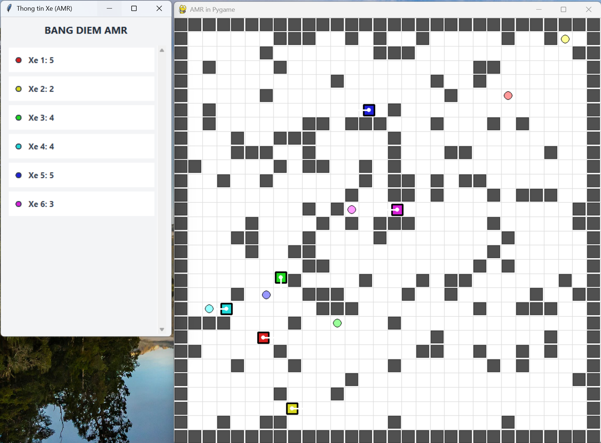
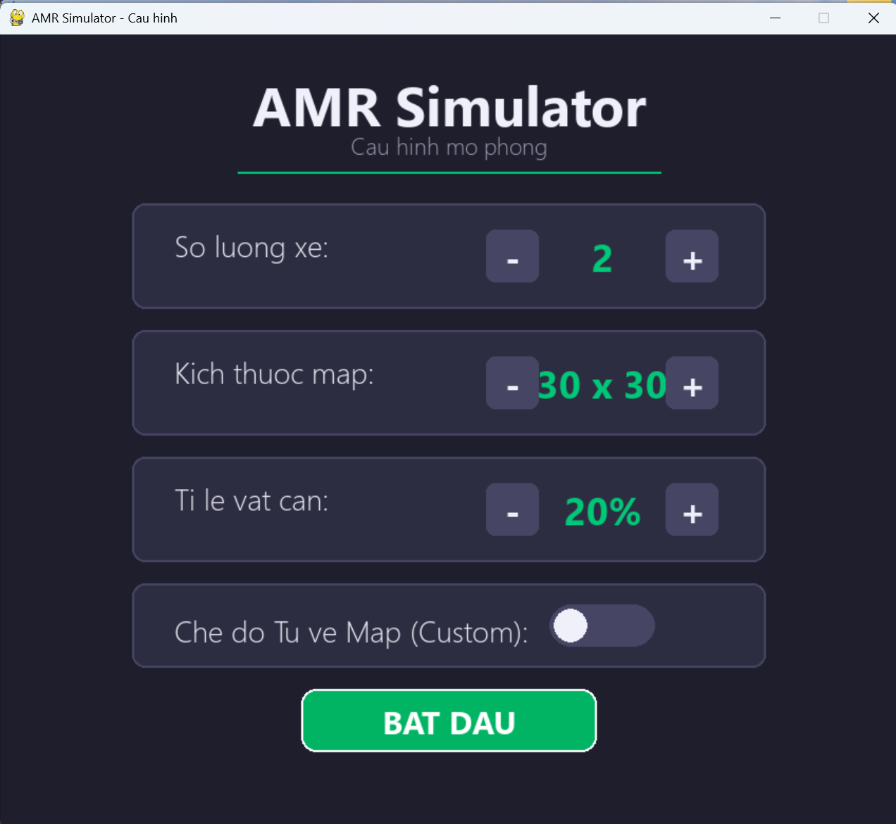
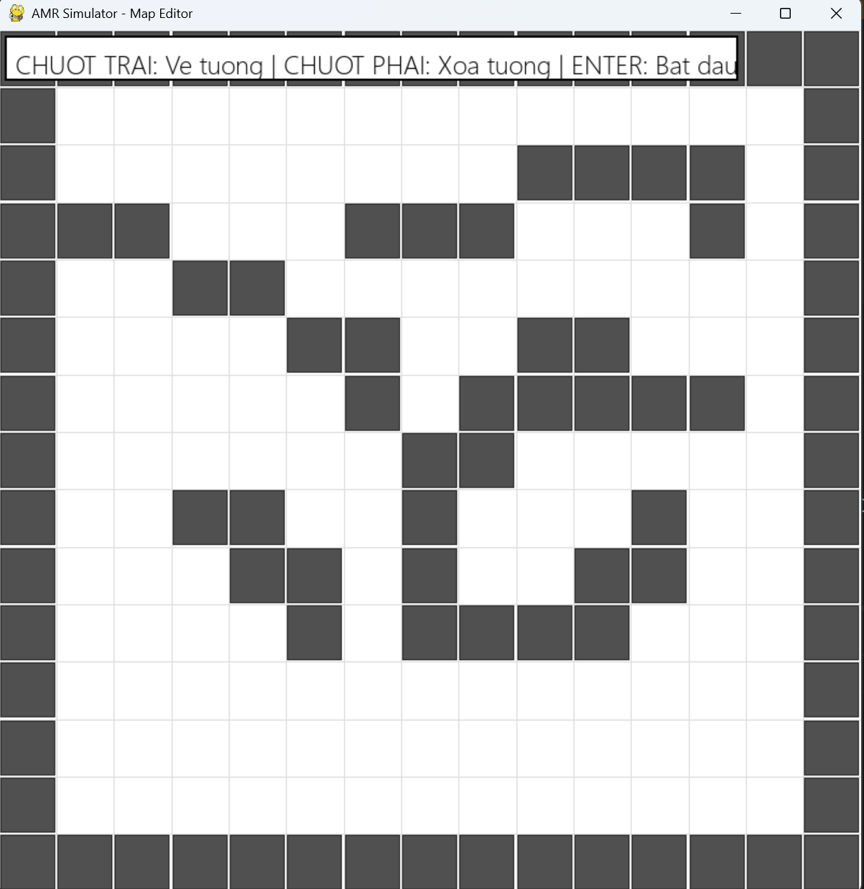
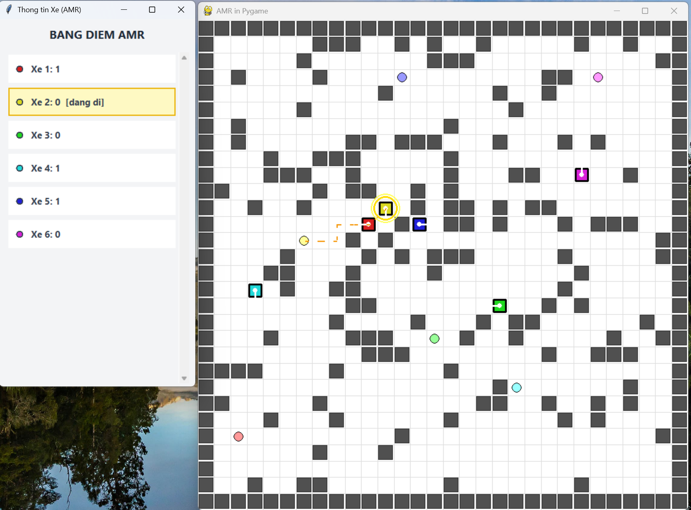

# 🚗 Hệ thống Mô phỏng Điều phối Đa Robot Tự hành (AMR) - ST-BFS & Manual Control


Đây là dự án mô phỏng hệ thống điều phối giao thông cho phi đội xe tự hành (AMR) hoạt động trong không gian nhà kho thông minh. Dự án áp dụng thuật toán **Spatio-Temporal BFS (ST-BFS)** để giải quyết xung đột đường đi thời gian thực và tích hợp cơ chế **Điều khiển chia sẻ (Human-in-the-loop)**.

<p align="center">
  
  <br>
  <em>Hình 1. Toàn cảnh hệ thống điều phối đa robot tự hành – các xe di chuyển song song và tự động tránh va chạm</em>
</p>

## ✨ Các tính năng nổi bật

| Tính năng | Mô tả |
|---|---|
| **ST-BFS Pathfinding** | Tránh va chạm tự động (Vertex & Edge Collision) trong không gian 3 chiều (x, y, t) |
| **Deadlock Resolver** | Tự động phát hiện xe kẹt cứng và ép xe ưu tiên cao nhường đường |
| **Manual Control** | Con người can thiệp thời gian thực, hệ thống tự dạt luồng nhường đường |
| **Map Editor** | Vẽ/xóa tường vật cản bằng chuột trước khi chạy mô phỏng |
| **Timeout Monitor** | Giám sát xe chờ quá 5 giây → tự động hủy đích và sinh mục tiêu mới |

## 🛠 Yêu cầu hệ thống

- Python 3.8 trở lên
- Thư viện `pygame`

## 🚀 Hướng dẫn Cài đặt & Chạy chương trình

```bash

# 1. Cài đặt thư viện
pip install -r requirements.txt

# 2. Chạy chương trình
python test.py
```

---

## 🎮 Hướng dẫn sử dụng Giao diện (UI)

### 1. Màn hình Cấu hình (Menu)

Khi vừa chạy `test.py`, cửa sổ Menu sẽ hiện ra cho phép bạn tinh chỉnh các thông số:

- **Số lượng xe:** Tăng/giảm số lượng AMR tham gia mô phỏng.
- **Kích thước map:** Thay đổi kích thước lưới bản đồ (ví dụ: 30×30).
- **Tỷ lệ vật cản:** Điều chỉnh mật độ tường ngẫu nhiên (mặc định 20%).
- **Chế độ Tự vẽ Map:** Bật/tắt để tự thiết kế bản đồ nhà kho.

<p align="center">
  
  <br>
  <em>Hình 2. Giao diện thiết lập cấu hình mô phỏng ban đầu</em>
</p>

### 2. Trình biên tập Bản đồ (Map Editor)

Nếu bạn bật chế độ "Tự vẽ Map", cửa sổ Editor sẽ hiện ra:

| Thao tác | Chức năng |
|---|---|
| 🖱 **Chuột trái** (kéo thả) | Xây tường – Vật cản tĩnh |
| 🖱 **Chuột phải** (kéo thả) | Xóa tường |
| ⌨️ **Phím ENTER** | Lưu bản đồ và bắt đầu mô phỏng |

<p align="center">
  
  <br>
  <em>Hình 3. Công cụ chỉnh sửa bản đồ thủ công – vẽ ranh giới tường bằng chuột</em>
</p>

### 3. Điều khiển thủ công (Manual Control)

Trong lúc hệ thống đang tự động chạy, bạn có thể can thiệp thủ công theo 3 bước:

> **Bước 1:** Click chuột trái vào một chiếc xe bất kỳ → Xe sáng vòng tròn vàng báo hiệu đang chờ lệnh.
>
> **Bước 2:** Click chuột trái vào một ô trống trên bản đồ → Hệ thống lập đường đi và ép các xe khác nhường đường ngay lập tức.
>
> **Bước 3:** Click vào tên xe trên "Bảng điểm (Scoreboard)" → Hủy điều khiển tay, trả xe về chế độ tự động.

<p align="center">
  
  <br>
  <em>Hình 4. Cơ chế điều khiển chia sẻ Người – Máy: xe được chọn (vòng tròn vàng) được cấp đặc quyền ưu tiên tối thượng</em>
</p>

## 📊 Đánh giá hiệu năng (Benchmark)

Dự án cung cấp script `benchmark.py` để chạy hệ thống ở chế độ Headless (không có giao diện đồ họa Pygame) nhằm đánh giá tốc độ tìm đường của thuật toán **ST-BFS** khi mở rộng số lượng xe (5, 10, 15, 20 xe).

### Cách chạy benchmark:

```bash
python benchmark.py
```

### Kết quả mẫu (1000 Ticks - Bản đồ 30x30 - 20% Vật cản):

```text
BAT DAU CHAY BENCHMARK...
So xe      | Diem so (Throughput)   | So lan ket (Timeouts)     | TG tinh toan (ms) | Tong TG chay (s)
---------------------------------------------------------------------------------------------------------
5          | 261                    | 0                         | 7.57           ms | 2.21 s
10         | 496                    | 0                         | 14.98          ms | 9.23 s
15         | 786                    | 0                         | 53.57          ms | 57.61 s
20         | 1010                   | 0                         | 26.97          ms | 39.95 s
```

*Ghi chú: Khi chạy benchmark, hệ thống sẽ tự sinh ra ảnh `benchmark_map.png` để lưu lại cấu trúc bản đồ ngẫu nhiên đã được dùng để kiểm thử.*

---

## 📂 Cấu trúc mã nguồn

```
BFS_chot/
├── test.py                 ← Điểm khởi chạy chương trình chính (Giao diện UI)
├── benchmark.py            ← Script chạy đánh giá hiệu năng (Headless)
├── requirements.txt        ← Khai báo thư viện cần cài đặt
├── core/                   ← Tầng điều khiển & giao diện
│   ├── application.py      ← Bộ điều khiển trung tâm (Main Controller)
│   ├── menu.py             ← Giao diện menu thiết lập cấu hình
│   ├── editor.py           ← Trình biên tập bản đồ thủ công
│   ├── graphic.py          ← Module render đồ họa Pygame
│   ├── input.py            ← Module thu thập sự kiện đầu vào
│   ├── map.py              ← Mô hình dữ liệu bản đồ lưới 2D
│   └── amr.py              ← Mô hình dữ liệu xe tự hành (AMR)
├── component/              ← Tầng xử lý thuật toán & cảm biến
│   ├── processor.py        ← Bộ xử lý thuật toán (BFS, ST-BFS)
│   ├── sensor.py           ← Module cảm biến phát hiện vật cản
│   └── actuator.py         ← Module cơ cấu chấp hành dự phòng
├── utils/                  ← Tầng tiện ích dùng chung
│   └── utils.py            ← Hàm toán học, tọa độ & biến đổi hình học
└── images/                 ← Ảnh chụp màn hình minh họa
    ├── menu.png
    ├── simulation.png
    ├── manual_control.png
    └── map_editor.png
```

## 🧠 Thuật toán cốt lõi

Hệ thống sử dụng bộ đôi thuật toán:

1. **BFS 2D tĩnh:** Công cụ chẩn đoán – phân biệt xe bị kẹt do tường (WALLED_OFF) hay do giao thông (TRAFFIC).
2. **Spatio-Temporal BFS (ST-BFS):** Thuật toán lõi – tìm đường trong không gian 3 chiều `(x, y, t)` với 5 hành động (Lên, Xuống, Trái, Phải, Đứng im). Tích hợp bộ lọc 3 lớp: Va chạm tĩnh, Va chạm đỉnh (Vertex), Va chạm cạnh (Edge/Swap).

---

